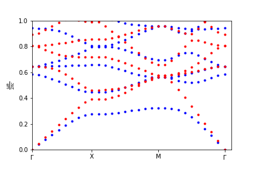
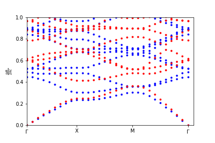

# Aurora

A personal implementation of 1-3D Plane Wave Expansion.
This software was developped to understand PWE, it is not really efficient.
If you are looking for this kind of software (but good), I recommand [mpb](https://mpb.readthedocs.io/en/latest/).

## 2D Examples

I will implement hexagonal lattices soon but for know, you can get square lattices shown in [Molding the Flow of Light](http://ab-initio.mit.edu/book/).

Figure 2, Chapter 5 of Molding the Flow of Light (2nd edition), the dielectric *rods*.

Figure 5, Chapter 5, the dielectric *veins*.

